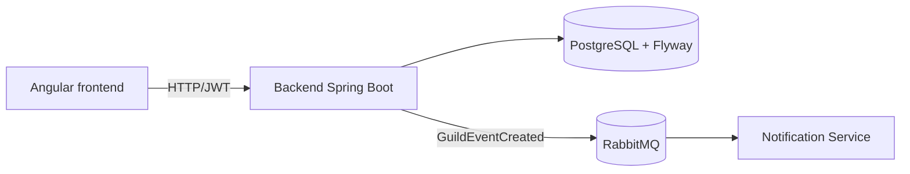

# Arquitetura e demonstração do Liderum

## Demonstração reproduzível

O ambiente local é iniciado com `docker compose up --build`. O PostgreSQL e o RabbitMQ aguardam seus healthchecks; o backend aplica Flyway em banco vazio e usa Hibernate `ddl-auto=validate`.

Fluxo sugerido:

1. Criar uma Guild e o primeiro administrador em `/register`.
2. Autenticar e consultar `/users/me`.
3. Criar um evento na Guild autenticada.
4. Confirmar nos logs do `notification-consumer` que o evento foi recebido.
5. Criar uma segunda Guild e demonstrar que seus dados não aparecem na primeira.

Health/status disponíveis:

- backend: `GET http://localhost:8080/actuator/health`;
- notification-service: `GET http://localhost:8081/actuator/health`;
- RabbitMQ: `docker compose exec rabbitmq rabbitmq-diagnostics -q ping`;
- PostgreSQL: `docker compose exec postgres pg_isready -U liderum -d liderum`.

Os endpoints Actuator expõem apenas o status, sem detalhes de dependências ou configuração.
